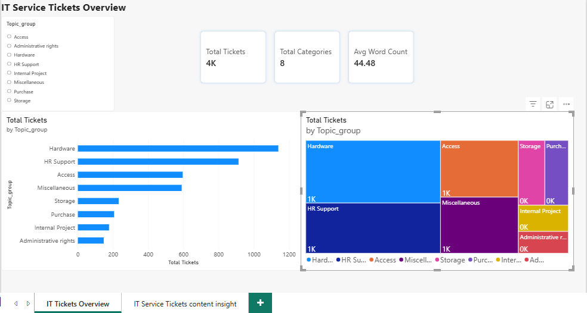
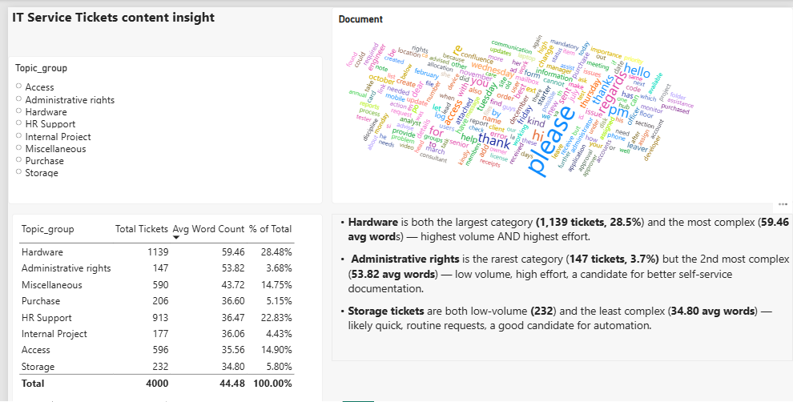

# IT Service Ticket Classification — Power BI Dashboard

## Problem Statement
IT service desks handle a high volume of support tickets across varied categories (hardware issues, access requests, HR support, and more). This project analyzes a sample of IT service tickets to understand how ticket volume is distributed across categories, and whether ticket complexity (measured by text length) differs by category — in order to identify workload hotspots and good candidates for automation or self-service.

## Dashboard Preview

## Data Source
- **Source:** Kaggle — [IT Service Ticket Classification Dataset](https://www.kaggle.com/datasets/adisongoh/it-service-ticket-classification-dataset) by adisongoh
- This is a public, pre-processed dataset used for a personal practice/portfolio project only — **not real employer data or professional work experience.**
- Full dataset: 47,837 tickets, 2 fields (`Document` = ticket text, `Topic_group` = category)
- For this project, a stratified random sample of 4,000 tickets was used (matching the original category proportions) to keep the file lightweight for local Excel/Power BI work.

## Approach
1. **Explored raw data in Excel** — verified all 8 ticket categories were present with no typos, confirmed no missing values, and prototyped Word Count / Character Count logic with Excel formulas as a sanity check.
2. **Loaded the CSV into Power BI** and used Power Query to remove duplicate tickets and engineer two calculated columns:
   - `Character_Count` = `Text.Length([Document])`
   - `Word_Count` = `List.Count(Text.Split([Document], " "))`
3. **Built DAX measures:** Total Tickets, % of Total, Avg Word Count, Max Word Count, Total Categories.
4. **Designed a 2-page Power BI report:**
   - **Overview** — KPI cards (Total Tickets, Total Categories, Avg Word Count), a bar chart and treemap of ticket volume by category, and a category slicer.
   - **Content Insights** — a Word Cloud of ticket text, a table of ticket volume and average word count by category, and written key findings.

## Tools Used
Microsoft Excel · Power BI Desktop (Power Query, DAX) · Claude AI (Power BI Modeling MCP) · Kaggle (data source)
*The DAX measures and calculated columns were designed by me; I took help from Claude AI, connected via an MCP-connected modeling server, where required to implement them — and reviewed and validated every formula against the data before keeping it.*

## Key Insights
- **Hardware** is both the largest category (1,139 tickets, 28.5%) and the most complex (59.46 avg words) — the highest-volume category is also the highest-effort one.
- **Administrative rights** is the rarest category (147 tickets, 3.7%) but the 2nd-most complex (53.82 avg words) — low volume, high effort, a good candidate for better self-service documentation.
- **Storage** tickets are both low-volume (232) and the least complex (34.80 avg words) — likely quick, routine requests, a strong candidate for automation.

## What This Led To — Phase 2
This analysis is Phase 1 of a two-part initiative. The Storage finding above — low volume, lowest complexity of all 8 categories — became the business case for **[Phase 2: IT Storage Request Self-Service Portal, a Business Requirements Document](https://github.com/bhavna-rao/it-storage-selfservice-portal-phase2)**, where that insight is turned into formal, stakeholder-ready requirements for a self-service solution. Phase 1 is the diagnostic analysis; Phase 2 is the requirements it justified.

## Files in this repo
- `Data/it_tickets_sample_4000.csv` / `.xlsx` — the 4,000-ticket working sample
- `Power BI/IT Service Ticket.pbix` — the Power BI report file
- `Docs/DAX_Measures_Explained.md` — plain-language writeup of every DAX measure
- `CASE_STUDY.md` — full business context, approach, findings, and recommendations
- `ScreenShots/` — dashboard page screenshots

## Note
This is a personal, self-directed portfolio project built using a public Kaggle dataset for practice purposes. It does not represent real company data, a client engagement, or professional work experience — it is presented here as a demonstration of Excel, Power Query, DAX, and Power BI dashboard-design skills.
